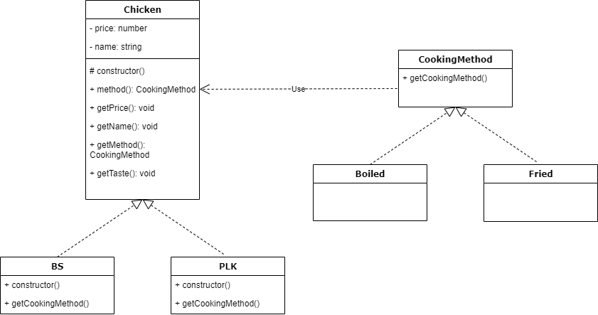

# Strategy Pattern

알고리즘 군을 정의하고 각각을 캡슐화하여 교환해서 사용할 수 있도록 만든다. Strategy를 활용하면 알고리즘을 사용하는 Client와는 독립적으로 Algorithm을 변경할 수 있다.

> 클라이언트의 기능을 캡슐화하여 집어넣는다. 여기서 캡슐화란, 클래스의 내부 변수와 메소드를 하나로 캐키징하여 응집도와 독립성을 높힌다.

## 명심해야 할 점
* 애플리케이션에서는 달라지는 부분을 찾아내고 달라지지 않는 부분으로부터 분리시켜야 한다.
* 구현이 아닌 인터페이스에 맞춰서 프로그래밍 한다.
* 상속보다는 구성을 활용한다.

## 예시

* `Chicken` Class의 `method()` 기능을 캡슐화해서 분리시켰다.
* `BS`(백숙)와 `PLK`(뿌링클) Class 내부에서는 Class 생성자에 `CookingMethod`를 구현한 Class인 `Boiled`와 `Fried`가 각각 들어가 있다.
